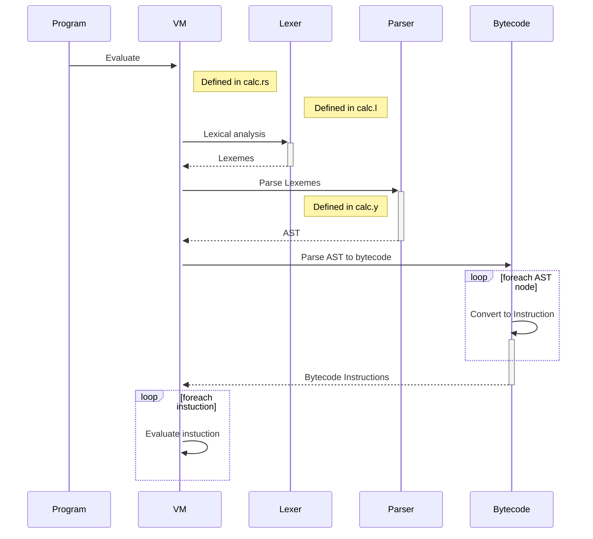

[](https://app.bors.tech/repositories/61986)

# pavel.yaiwr

Yet Another Interpreter Written In Rust

## CI

[Buildbot](https://ci.soft-dev.org/#/builders/1)
[Bors repository](https://app.bors.tech/repositories/61986)

## Usage

### Repl

```shell
$ cargo run 
👉 2+1 
3
```

### Cli args
```shell
$ cargo run 'println(2+2+3);'
6
6
6
```

### File
```shell
$ cargo run ./programs/print.yaiwr
4
```

### Logs

Log levels can be configured via the environment variable: RUST_LOG.
```shell
RUST_LOG=info cargo run -- '2+2'
RUST_LOG=debug cargo run -- '2+2'
RUST_LOG=error  cargo run -- '2+?'
```
env_logger crate [docs](https://docs.rs/env_logger/0.10.0/env_logger/)

## Tests

```shell
# run unit tests
$ cargo test
# run language unit tests
$ cargo test --test lang
# run test in a container
$ run_docker_ci_job # optional (--prune)
```

## Langugage Spec(ish)

### Types

#### Numbers

Integers are supported as numeric values. 

Integers are stored as whole numbers as Rust `u64` constant for the 64-bit unsigned integers.

Example:
```
let _a = 123;
```

#### Booleans

Booleans represents a value, which could be `true` or `false`. 

Example:
```
let _t = true;
let _f = false;
```
#### Boolean Comparison Operators

| Symbol |  Meaning  | Example |
|:-----|:--------:|------:|
| >   | Greater than | `1 > 2`|
| <   |  Less than  a| `2 < 1`|

Example:
```
(1+2) > 3 # false
1000 > 42 # true
let _a = 1 > 2;
```

### Comments

YAIWR comments can be used to explain the YAIWR code. 
YAIWR comments can be used to prevent execution when testing alternative code.

Convention:

1. Single line comments should start with `//`
2. No multi-line comment supported

Example:

```
let _a = 4; // let _a = 5;
// let _a = 5;
println(_a);
```
In this example, the output will be `4`.

### Statements

`println` - Prints to the standard output, with a new line

Example:

```
println(1+2);
println(1);
```

### Variables

Variable names:

Variable names can only include alphanumeric and underscore ("_") characters

```
let <name> = <expression>;
```

`let` - keyword indicating the beginning of the variable declaration

`<name>` - variable name

`<expression>` - expression that will be evaluated and assigned to the variable

Example:
```
let someVariable = (1+2);
let someVariable3 = 1;
let x = 2;
let y = 1 * _x;
```

### Functions

#### Function Declaration

```
fun <name> (<params>) { <statements> }
```

`<fun>` - keyword indicating the beginning of a function declaration

`<name>` - any alphanumeric sequence

`<params>` - (optional) single or list of parameters passed to the function

`<statements>` - statements that comprise the body of the function

Example:
```
fun add (_arg1, _arg2){ return _arg1 + _arg2; }

fun add1 (_arg1){ 
  return _arg1 + 1; 
}
```
#### Function calls

`<name>` (`<arguments>`)

`<arguments>` - (optional) single or list of parameters passed to the function

Example:
```
add(1,2)
```

#### Function Scope

- Variables declared within a function, become "local" to the function.
- Variables declared in the outer scope of a function are accessible by the "local" function  context

Example:
```
let g = 0;
// code here can't use "a" variable

fun f() {
  // code here can use "g" variable
  let a = 2;
  // code here can use "a" variable
}

// code here can't use "a" variable

```

# TODOs

[x] Go through the calc example in the quick start guide

[x] Implement a testing framework

[x] Split between "compile an AST to Vec<Opcode> and then have an evaluator which takes Vec<Opcode> and executes the program"

[x] Implement stack-based VM

[x] Implement print statement

[x] Implement variables

[x] Implement functions

[x] Implement conditional statements

[x] Propogate all errors to top-level where the error is printed

[x] Add support for custom error handling, i.e InterpError

[x] Implement function scope

[x] Multi-line statements support as it was intended in https://github.com/softdevteam/pavel.yaiwr/pull/17

[x] Add comments support

[x] Integrate lang_tester https://lib.rs/crates/lang_tester

[x] Allow function calls without `;`, for example: `add1(add1(1))` instead of `add1(add1(1););`

[ ] Compile variable names to integers

[ ] Use actions to make an AST on the fly (see e.g. https://github.com/ltratt/pizauth/blob/master/src/config.y)

[ ] Add variable declaration and out-of-parsing-time computation

[ ] Benchmarking

[ ] Revise Rust in general :)

[ ] Add multi-line comments support. See previous PR attempt: https://github.com/softdevteam/pavel.yaiwr/pull/22.

# Terminology

**Parse Tree** - includes all the "useless" syntactic information that humans like/need but doesn't affect compilation

**AST** - strip out that useless syntactic stuff

**Evaluator** - evaluates something (parse tree, AST, or opcodes) directly; a "compiler" converts one thing into another

**Stack-based machines** - Stack for operands and operators, the result is always on top of the stack

# YAIWR architecture overview



# Resources

[Building a Virtual Machine [2/29]: Stack vs. Register VM](https://www.youtube.com/watch?v=7hrLD4z8eUA&ab_channel=DmitrySoshnikov)

[Which Parsing Approach?](https://tratt.net/laurie/blog/2020/which_parsing_approach.html)

[Yacc](https://web.archive.org/web/20220830093827/dinosaur.compilertools.net/yacc/index.html)

[Quickstart](https://softdevteam.github.io/grmtools/master/book/quickstart.html)
Yet Another Interpreter Written In Rust

[Grammars](https://github.com/softdevteam/grammars/)

[ANSI C grammar, Lex specification](https://www.lysator.liu.se/c/ANSI-C-grammar-y.html)